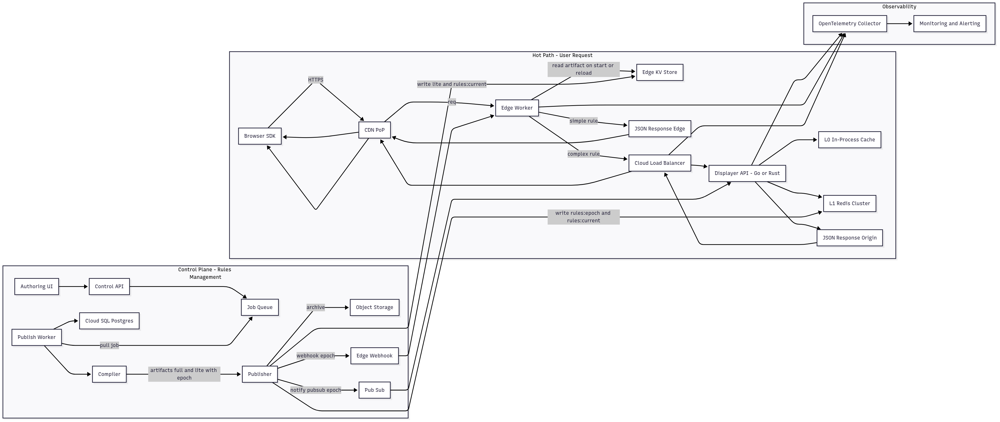

# Webyn Displayer API Architecture Case Study

## Introduction

Achieving a response time under 100 milliseconds is **really difficult**! Here's why.

### The Laws of Physics

The first adversary is an immutable constant: the speed of light in optical fiber, which is approximately **200,000 km/second**. With the shortest distance between Paris and New York being **~5,850 km**, the theoretical minimum round-trip time (RTT) is a simple calculation:

$$RTT_{theoretical} = \left(\frac{5850 \text{ km}}{200{,}000 \text{ km/s}}\right) \times 2 \approx 58.5 \text{ ms}$$

This figure of **~59 ms** represents a perfect world, with a straight submarine cable and no intermediate equipment. Impossible in the real world, as in practice, the travel time is always higher.

In the real world, we measure around 70–80 ms, confirmed by Azure, AWS and GCP. For example, **Azure** shows **~76 ms Paris ↔ East US**, confirmed by **CloudPing** and **GCPing**.

**Sources:**

- [Azure network round-trip latency statistics](https://docs.microsoft.com/fr-fr/azure/networking/azure-network-latency)
- [CloudPing for AWS](https://www.cloudping.info/)
- [GCPing for Google Cloud](https://gcping.com/)

These few extra milliseconds come from the non-linear path of cables (visible on the [Submarine Cable Map](https://www.submarinecablemap.com/)) and the processing time of each network device along the way.

A simple round trip already consumes nearly 80% of the time budget. This imposes two non-negotiable requirements on our infrastructure:

1. **Global Proximity (Multi-Region)**: You can't cheat geography. The architecture must be **globally distributed** across multiple cloud **regions** (e.g., Paris, Tokyo, Virginia…) to physically get closer to each user. This is the foundation of the **Edge-First** strategy.

2. **Local Resilience (Multi-AZ)**: Within each region, reliability must be absolute. This is where **multi-AZ** (multi-availability zone) architecture comes in. By deploying our services across multiple distinct datacenters within the same region, we guarantee high availability and consistently low latency for users in that region.

Targeting under 100 ms forces us to design an **edge-first** network that is global and locally redundant.

---

## Context & Principles

The Displayer API is at the heart of the user experience. It must:

- serve 1,000 requests per second with latency under 100 ms,
- guarantee consistency of experiences for the same user during a session,
- absorb load growth up to ×10 in the coming years.

To address this, four principles guide the design:

- **Edge-First**: process simple rules directly as close as possible to the user.
- **Cache-Centric**: never depend on a relational database in the hot path: only fast memory (in-proc and Redis) is used.
- **Stateless**: keep services stateless to simplify horizontal scaling.
- **Control/Data Plane Separation**: isolate rule governance (control) from request processing (data).

---

## Proposed Architecture

The system is organized into two distinct flows: the **hot path** to respond to users in real-time, and the **control plane** to manage rules and orchestrate deployments.

On the user side, the browser SDK calls a CDN Point of Presence. The local Edge Worker first evaluates the request with a "lite" artifact loaded in memory. If the criteria are simple (country, device, cookie), the decision is made immediately and the response is returned in less than 60 ms. If central data is required (e.g., purchase history), the Worker redirects to the origin. There, the Displayer API (Go/Rust, stateless) consults its successive caches: L0 in process memory (<1 ms) then L1 Redis (~1–2 ms). If necessary, it computes the decision and inserts it into cache. This more expensive path stays under 100 ms.

On the management side, when a marketer publishes a new experience via the UI, the request is serialized into a Job Queue. A single Worker processes it: it records the configuration in Postgres (source of truth), then calls the compiler. The compiler generates two immutable, versioned artifacts (by timestamp): a complete one for the API, and a "lite" one optimized for the Edge. The Publisher then distributes these artifacts to Redis, Edge KV, and archive storage. Finally, it notifies services via Pub/Sub (origin) and ] (Edge) to trigger hot reload.

---

## Guarantees & Organization

User-side consistency is ensured by two mechanisms. The first is **session pinning**: the first response sets a rules version (*rulesVersion*), which the SDK then sends back with each call. The second is **N/N+1 read**: during an update, the API maintains both the old and new versions, ensuring that an ongoing session is never interrupted.

Robustness is also ensured by the Job Queue, which sequences all publications to avoid collisions. Rule deployments are performed via hot reload, without service interruption, and application services follow a CI/CD pipeline with unit tests, integration, performance testing, and progressive deployment (canary + automatic rollback).

---

## Monitoring and Operations

Observability relies on three pillars. **Metrics** (latency p50/p90/p99, 5xx errors, CPU/memory saturation, cold starts) allow continuous monitoring of system health. **Distributed traces**, collected via OpenTelemetry or Datadog, provide an end-to-end view of a request's path (Edge → API → Redis). Finally, **structured JSON logs** make investigation fast and ] (e.g., all cache-misses for a given userId).

Alerting is based on SLO and burn rate tracking: rather than alerting on a CPU threshold, an alert is triggered if too much error budget is consumed in a short time, allowing action before customer experience is affected.

---

## Example: Alice (Webyn customer) in the Control Plane

Alice, a marketing manager, publishes a new "Green Button" test:

1. She uses the Webyn UI (for the sake of this take-home assignment) to configure the rule: "France + Mobile = variation B (green button)".
2. The UI calls the Control Plane API → which places the request in a Job Queue.
3. A single Worker processes the request: it saves the config in Postgres, then triggers the compiler.
4. The compiler generates two versioned artifacts (by timestamp):
   - **artifact_full**: all rules for the API.
   - **artifact_lite**: optimized version for Edge Workers.
5. The Publisher distributes these artifacts: full → Redis, lite → Edge KV → Object Storage.
6. Notifications:
   - Pub/Sub → Displayer API for hot reload.
   - Webhook → Edge Workers to reload the lite artifact.

Within seconds, Alice's test is live globally, without redeployment and without downtime.

---

## Example: Bob (visitor) in the Hot Path

Bob visits an e-commerce site that is a Webyn client.

1. The SDK in his browser sends a request with his anonymous userId and the context pageType=product.
2. At the PoP, an Edge Worker reads the lite artifact in memory. Alice's "Green Button" rule is simple (based on country + device), so it's evaluated directly in <50 ms.
   → Bob receives the decision "variant_B" in JSON.
   → The SDK applies the action: the button turns green.
3. If the rule had been complex (e.g., dependent on his purchase history), the Edge Worker would have routed to the Origin API. There, the API consults L0 (in-proc <1 ms), then L1 (Redis ~2 ms). If necessary, it computes the decision and caches it. The response returns in ~80–100 ms.
4. For Bob, the page loads without flicker: he sees the green button immediately, consistent throughout his session.
5. For Bob, it's just a simple green button 🙂

---

## Diagram

